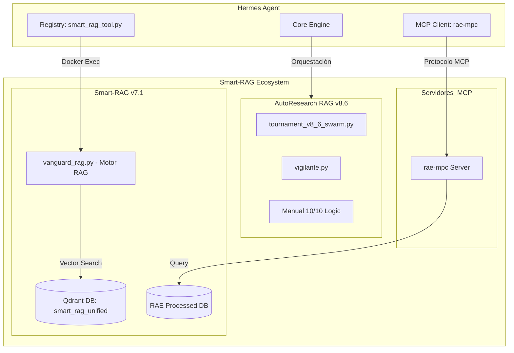

# Estructura Técnica: Smart-RAG Editorial Suite (v8.X)

## 1. Arquitectura de Componentes
Smart-RAG es un ecosistema modular diseñado para la investigación y generación de contenido técnico de alta fidelidad.

## 2. Directorios Clave y Funciones

### `C:\...\smart-RAG\autoresearch-RAG` (Motor v8.6)
*   **tournament_v8_6_swarm.py**: Motor de generación paralela que divide el post en secciones y asigna agentes especialistas.
*   **vigilante.py**: Orquestador de colas de prioridad y manejo de Rate Limits (Catch & Batch).
*   **config/framework_best.md**: El estándar de oro para la redacción técnica.

### `C:\...\smart-RAG\Smart-RAG-v7-main` (Capa de Conocimiento)
*   **rae-mpc/**: Servidor de protocolo MCP que expone la base de datos de la RAE para correcciones en caliente.
*   **smart_rag/services/vanguard_rag.py**: Servicio premium de recuperación de contexto histórico y técnico.
*   **data/processed/**: Repositorio de datos estructurados, incluyendo el Manual de Estilo de la RAE 2018.

### `C:\...\smart-RAG\logs\qdrant_storage` (Persistencia)
*   Almacenamiento físico de los embeddings vectoriales utilizados por el sistema de búsqueda.

## 3. Flujo de Interacción con Hermes
Para esta prueba analítica, Hermes asume el mando y utiliza Smart-RAG como su brazo ejecutor de investigación:

1.  **Fase 1 (Investigación)**: Hermes invoca `smart_rag_query` para extraer datos históricos sobre la Armada Castellana y El Glorioso desde Qdrant.
2.  **Fase 2 (Redacción)**: Hermes supervisa la generación, aplicando los parámetros de la "Estación 2" (Redactor) y emulando el comportamiento Swarm.
3.  **Fase 3 (Refinado)**: Hermes utiliza el servidor MCP `rae-mpc` para validar que el texto final cumple con las normas académicas del castellano.
4.  **Fase 4 (Evaluación)**: El Juez Gigante (DeepSeek R1) valida el resultado contra las directrices E-E-A-T 2025.
